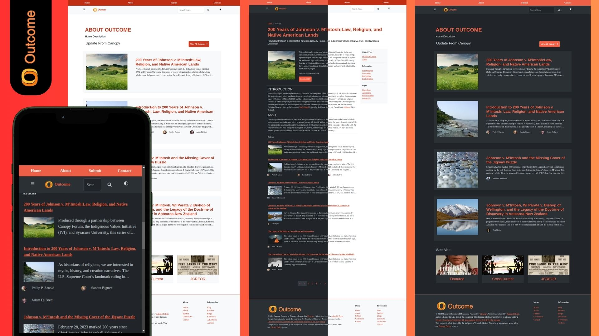
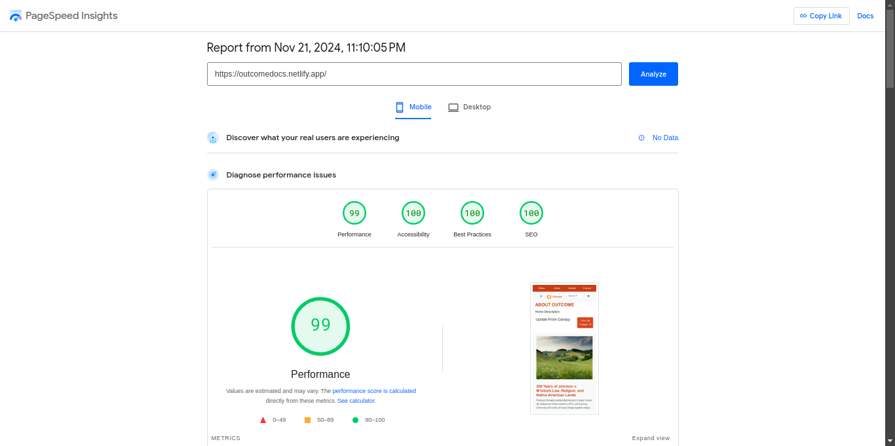
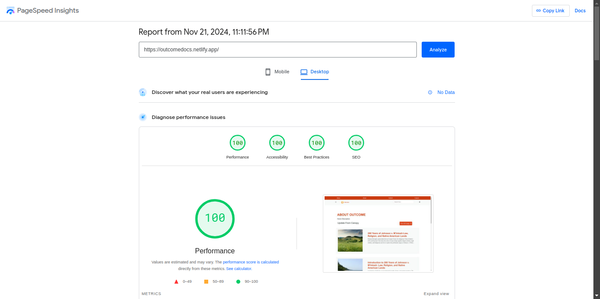
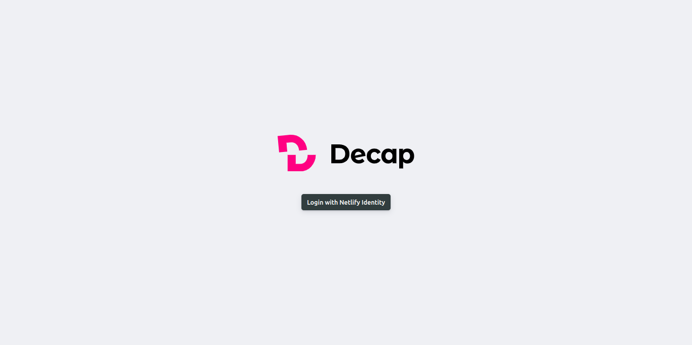

# OUTCOME 🚀

The Outcome Documents for the Henry Luce Foundation Grant 200 Years of Johnson v. M’Intosh (JvM): Indigenous Responses to the Religious Foundations of Racism.

👩‍🚀 Project by [Adam DJ Brett](https://www.adamdjbrett.com)

👩‍🚀 Developer [Adam DJ Brett](https://www.adamdjbrett.com)

🛰 JAMSTACK SSG [11ty](https://11ty.dev) V.3 aka Eleventy

## Status 

---

## Test URL

[https://outcomedocs.netlify.app](https://outcomedocs.netlify.app)

---

### Peformance

Mobile Peformance

Desktop Peformance

---

### Features ❤️

+ 11ty Eleventy
+ Header Anchor
+ TOC
+ Pagefind
+ Purge CSS
+ Dark Mode
+ Light Mode
+ FontAwesome
+ Responsive Mobile First
+ Auto SEO injection Script
+ Collections
+ Collections Pagination
+ Article Page
+ Article Pagination
+ Tags
+ Multi Author
+ Author Profile
+ Contact Form
+ Abstract
+ Cite
+ Bib Download
+ PDF Download
+ Author Profile
+ Author Link and Icon
+ Custom Icon
+ WSRV image CDN
+ Formspree
+ Headless Decap Netlify CMS Integration

---

### HOW TO 

+ Home Page : To update the home page
+ Pages : To update static page , such about, contact and others.
+ Canopy Easay 1: To update and create new Canopy essay 1 article collections page
+ Canopy Easay 2: To update and create new Canopy essay 2 article collections page
+ Cross Currents Easay 1: To update and create new Crosscurrents essay 1 article collections page
+ Cross Currents Easay 2: To update and create new Crosscurrents essay 2 article collections page
+ Featured Easay 1: To update and create new Featured essay 1 article collections page
+ Featured Easay 2: To update and create new Featured essay 2 article collections page
+ JCREOR Easay 1: To update and create new JCREOR essay 1 article collections page
+ JCREOR Easay 2: To update and create new JCREOR essay 2 article collections page
+ Tags Page: To update tags page
+ 404 Page: To update 404 not found page
+ Website Setup: For Site Settings
+ Navbar Setup: To set the navbar header
+ Sidebar Setup: To set the sidebar widget
+ Footer Setup: To set the footer area

On the CMS there is: `Fill if you use this feature or leave it blank if you do not use this feature.`.

You can use the feature by filling in the data, or leave it blank if you do not want to display it.

### Show Table of Contents: 

You can click disable if you don't want to display the table of contents in the article sidebar.

### Custom Icon Author: 

If you want to use a custom icon for the author, then you can fill in the custom icon, upload the icon and enter your site url. By using a custom icon, you can empty the area on the author profile icon - because it has been replaced with a custom icon.

## CHANGELOG
- CMD+K should take one directly into search
- homepage tweaks