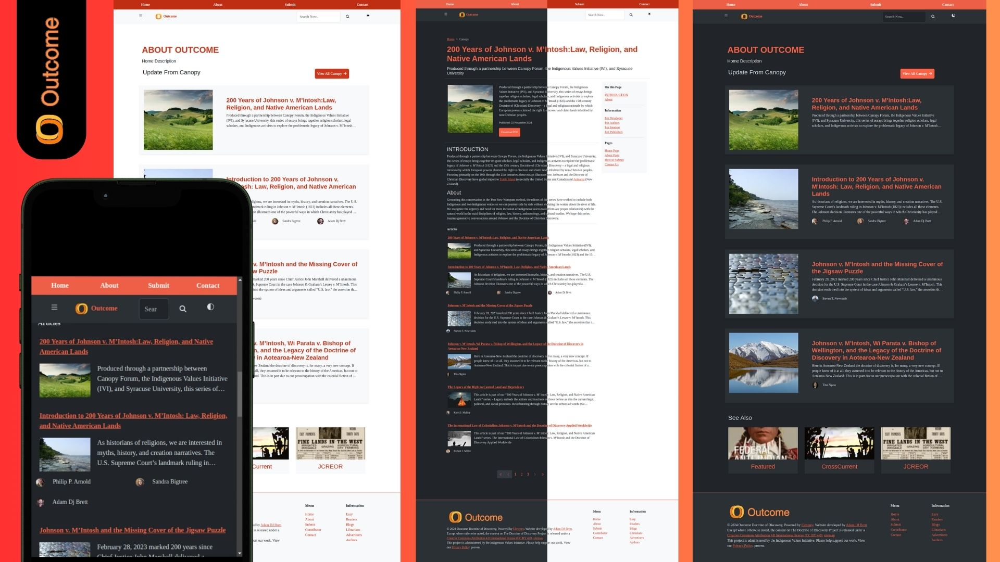
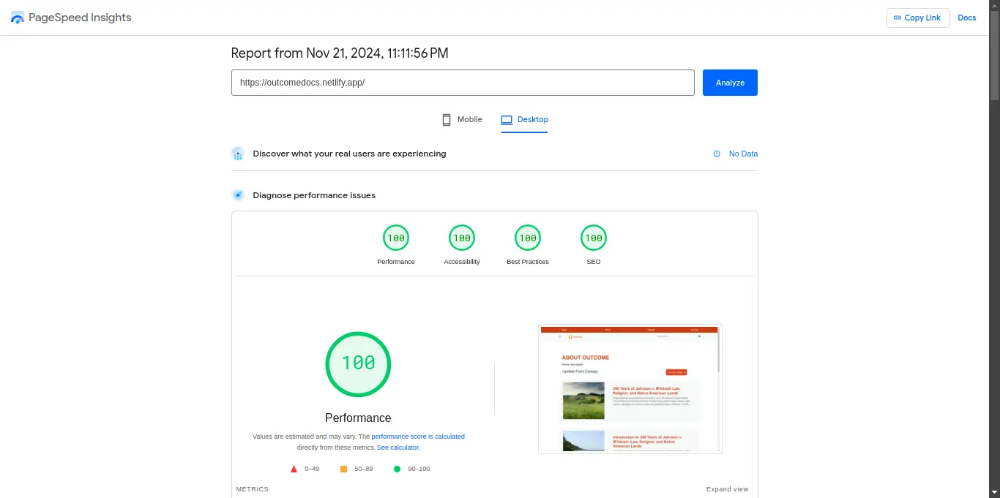
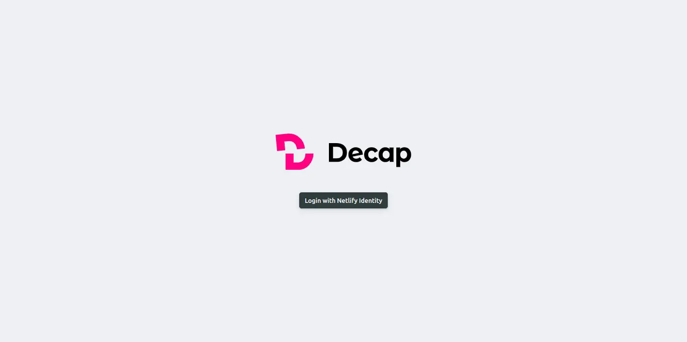

# OUTCOME 🚀

The Outcome Documents for the Henry Luce Foundation Grant 200 Years of Johnson v. M’Intosh (JvM): Indigenous Responses to the Religious Foundations of Racism.

🛰 Project by [Adam DJ Brett](https://www.adamdjbrett.com)

👩‍🚀 Developer [Adam DJ Brett](https://www.adamdjbrett.com)

📡 JAMSTACK SSG [11ty](https://11ty.dev) V.3 aka Eleventy

🕹️ Headless CMS [Decap CMS](https://decapcms.org/)

🪐 Hosting [Netlify](https://netlify.com/)

---

## ⚙️ Status

---

## 💫 Test URL 

[https://outcome.doctrineofdiscovery.org](https://outcome.doctrineofdiscovery.org)

---

### 🏎️ Peformance

📱 Mobile Peformance

🖥️ Desktop Peformance

---

### ✨ Features ❤️

+ 11ty Eleventy
+ Header Anchor
+ TOC
+ Pagefind
+ Purge CSS
+ Dark Mode
+ Light Mode
+ FontAwesome
+ Responsive Mobile First
+ Auto SEO injection Script
+ Collections
+ Collections Pagination
+ Article Page
+ Article Pagination
+ Tags
+ Multi Author
+ Author Profile
+ Contact Form
+ Abstract
+ Cite
+ Bib Download
+ PDF Download
+ Author Profile
+ Author Link and Icon
+ Custom Icon
+ WSRV image CDN
+ Formspree
+ Headless Decap Netlify CMS Integration
+ Access Key / Short Key
+ Netlify Identity

---

### 📖 HOW TO 📌

+ Home Page : To update the home page
+ Pages : To update static page , such about, contact and others.
+ Canopy Essay 1: To update and create new Canopy essay 1 article collections page
+ Canopy Essay 2: To update and create new Canopy essay 2 article collections page
+ Cross Currents Essay 1: To update and create new Crosscurrents essay 1 article collections page
+ Cross Currents Essay 2: To update and create new Crosscurrents essay 2 article collections page
+ Featured Essay 1: To update and create new Featured essay 1 article collections page
+ Featured Essay 2: To update and create new Featured essay 2 article collections page
+ JCREOR Essay 1: To update and create new JCREOR essay 1 article collections page
+ JCREOR Essay 2: To update and create new JCREOR essay 2 article collections page
+ Tags Page: To update tags page
+ 404 Page: To update 404 not found page
+ Website Setup: For Site Settings
+ Navbar Setup: To set the navbar header
+ Sidebar Setup: To set the sidebar widget
+ Footer Setup: To set the footer area
+ Easy 2 Posts automaticly showd on homepage **NEW**

On the CMS there is: `Fill if you use this feature or leave it blank if you do not use this feature.`.

You can use the feature by filling in the data, or leave it blank if you do not want to display it.

### 📖 Show Table of Contents: 

You can click disable if you don't want to display the table of contents in the article sidebar.

### 📖 Custom Icon Author: 

If you want to use a custom icon for the author, then you can fill in the custom icon, upload the icon and enter your site url. By using a custom icon, you can empty the area on the author profile icon - because it has been replaced with a custom icon.

## CHANGELOG 📝

### January 25-26, 2026
+ **MAJOR BUILD OPTIMIZATION**: Achieved 96% build performance improvement
  - Reduced Netlify build time from 136+ seconds to 4.32 seconds
  - Implemented optimized build pipeline using prebuilt image strategy
  - Added ultra-fast build commands for Netlify deployment
  - Streamlined image processing and dependency management
+ **JavaScript Performance Fix**: Resolved browser console warnings
  - Fixed Cloudflare Rocket Loader preload conflicts causing credentials mode mismatch
  - Disabled automatic JavaScript optimization to eliminate unused preload warnings
  - Improved page load performance and console cleanliness
+ **Development Workflow**: Enhanced build efficiency for faster iteration cycles

02 Sep 2025
+ Add IJR Page
+ Add IJR Content
+ Add IJR into footer information
+ Add IJR into sidebar
+ Add List Templating for IJR
+ Add Article Templating for IJR
+ Add Pagination List IJR
+ Add Pagination Article for IJR
+ Add UI for IJR
+ integration IJR into Headless CMS
+ Custom index headless cms jcreor
+ Custom index headless cms featured
+ Custom index headless cms crosscurrents
+ Custom index headless cms canpoy
+ Custom index headless cms ijr
+ Custom index headless cms podcast

- CMD+K should take one directly into search
- homepage tweaks
- possible alt colors
    - Outcome Red: #FF4136
    - Outocme Orange: #FF851B

28 June 2025
+ Fix crosscurrent list url to be crosscurrents
+ Add functions to see error about duplication tags
+ Fix breadcumb link crosscurrents
+ Add Content for Crosscurrent

29 June 2025
+ Fix all posts fetch on home page 
+ Add functions to fetch all posts data on home page
+ Change Index Start Themes
+ Split easy 2 posts to display on homepage
+ Pagination All Article List on home page

